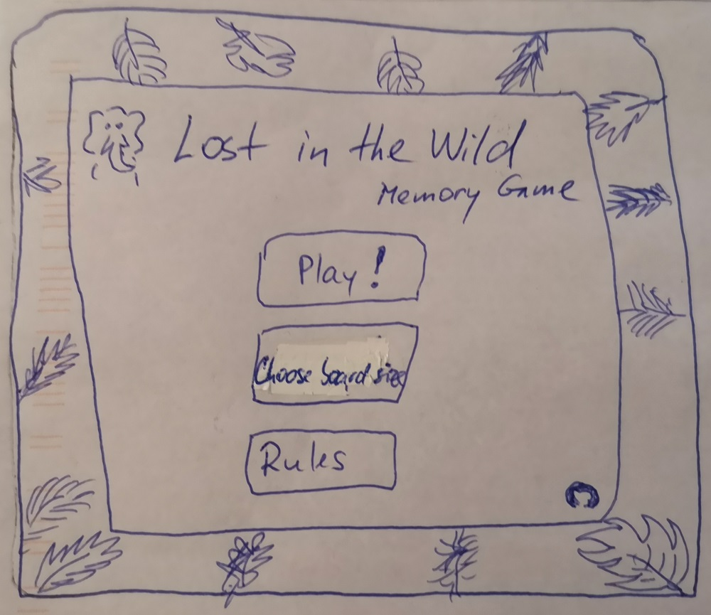
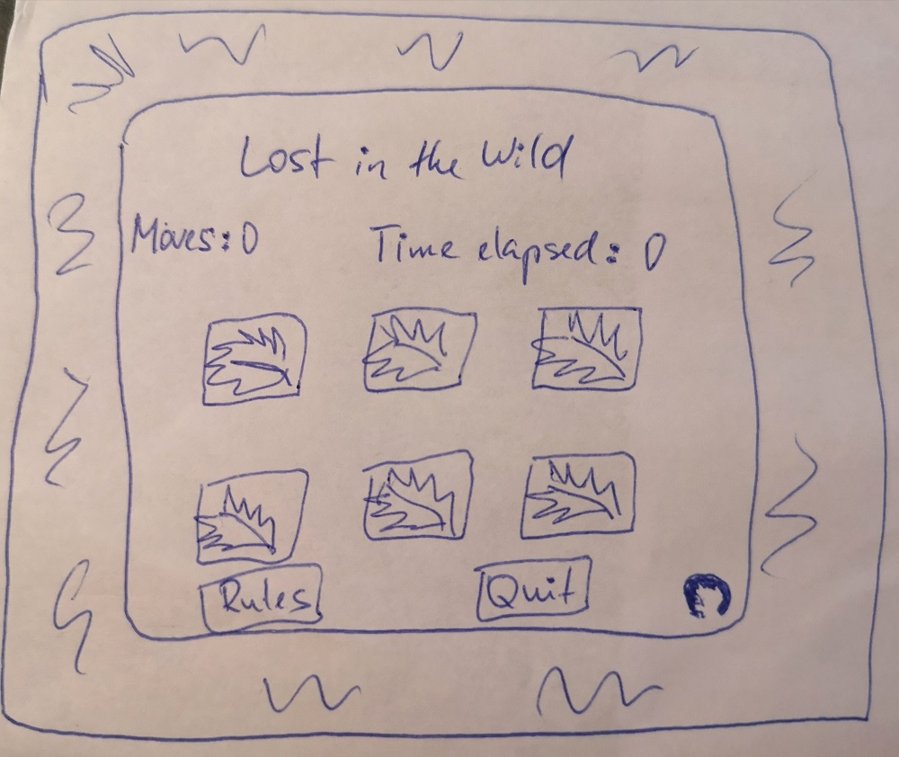
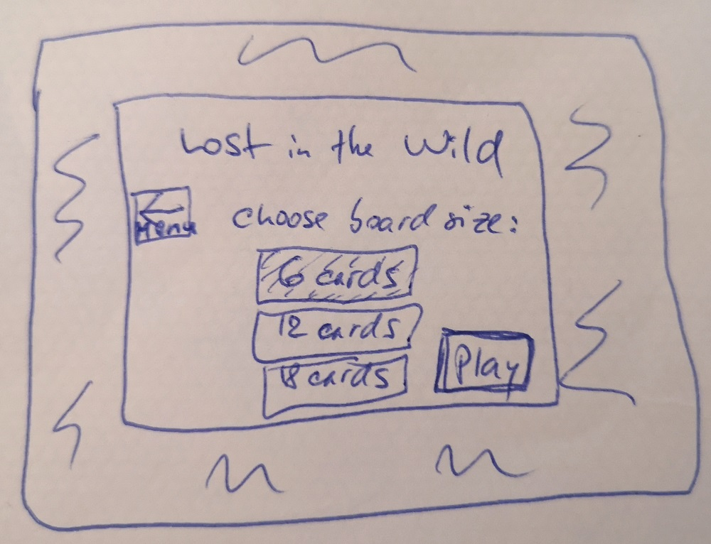
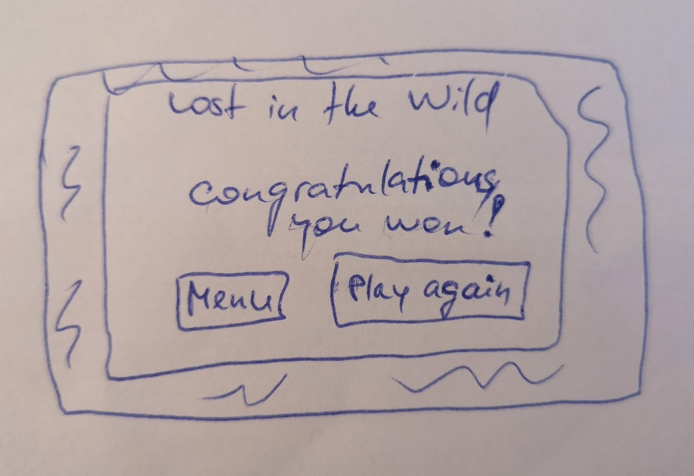
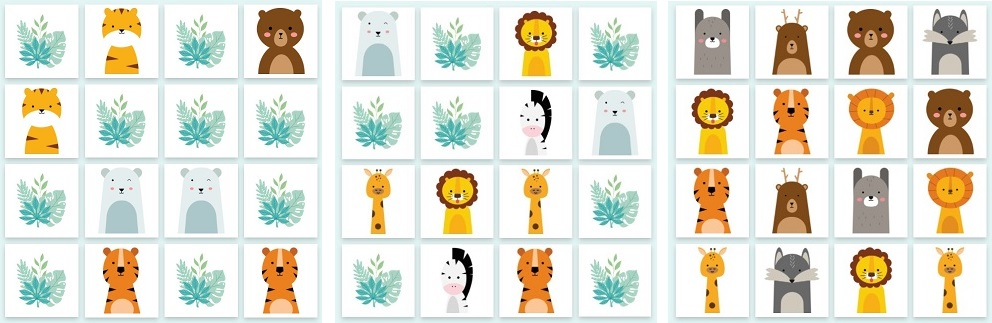
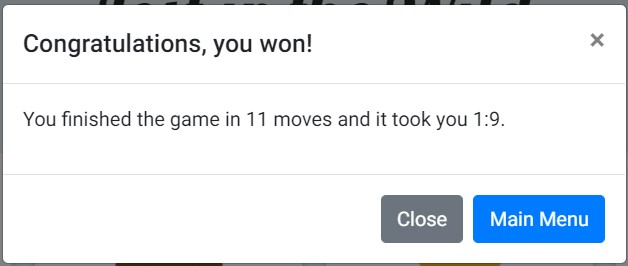

# Lost in the Wild Memory Game
_“Life is more fun if you play games.” - Roald Dahl_

Lost in the Wild is a web-based single-player memory game. Its objective is to find all the matching pairs of animals hiding in the wild. Memory games like this one, while fun to play, can also be used as tools to improve a player's short-term memory, attention, concentration, and focus.

The game was built as my second milestone project for Code Institute's Full Stack Software Development course. The topic for the project was chosen because the memory game (Pexeso) was one of my most favourite games growing up.

You can view the live website [here](https://monika-hrda.github.io/memory-game/ "Lost in the Wild | Memory Game"). 
***
## User Experience (UX)

### User Stories

As a user, I want to be able to: 

* easily understand what the purpose of the website is.
* navigate the website easily and intuitively.
* find instructions on how to play the game.
* choose various difficulty levels of the game.
* keep track of my progress in the game.
* view the website clearly on multiple devices, including my mobile device, so that I can achieve my other goals on the go.
* find the website's creator on Github, so that I can learn more about and/or follow them to keep up with their updates.

### Design

* #### Colour Scheme

* #### Typography

  [Lobster font](https://fonts.google.com/specimen/Lobster) has been used for the main heading as it is more untraditional and conveys playfulness. 

  [Roboto](https://fonts.google.com/specimen/Roboto) has been identified as a perfect pairing to Lobster for its relative simplicity and readability (as per research on [The 30 Best Font Combinations for Web Design​](https://elementor.com/blog/font-pairing/)).

* #### Imagery

### Wireframes

* Main menu

* Board view

* Choose board size view

* Result view

***
## Features

### Existing Features

### Features Left to Implement in the Future

***
## Technologies Used

### Languages Used

* JavaScript
* HTML5
* CSS3

### Frameworks, Libraries & Programs Used

* [Bootstrap v4.6](https://getbootstrap.com/docs/4.6/getting-started/introduction/) - to assist with responsiveness and styling of the website
* [Bootstrap Icons](https://icons.getbootstrap.com/) - to display icons for social media in the footer
* [Google Fonts](https://fonts.google.com/)
* [https://svgtopng.com/](https://svgtopng.com/) - to convert SVG files to PNG
* [https://www.iloveimg.com/](https://www.iloveimg.com/) - to resize multiple PNG files at once
* [https://onlinepngtools.com/](https://onlinepngtools.com/) - to fit PNG files in a rectangle
* [https://imagecompressor.com/](https://imagecompressor.com/) - to compress image files
* Git
* Github
* Gitpod
* GitHub Pages
* Google Chrome Developer Tools

***
## Testing

During the development process, the game was continuously tested and bugs and issues that were found were resolved. A few examples would be:

* Using class 'card' on cards caused issue with displaying them because of Bootstrap using the class for their own card component. The custom class was renamed as soon as I realised that.
* It took some JavaScript magic to create Bootstrap rows dynamically. 
* While working on the cards flipping mechanism, there were issues with getting cards to be responsive without getting their images squished, the rows disappering completely, images and cards overlapping, the height not being responsive, etc. A lot of it was solved by discovering the CSS properties 'aspect-ratio' and 'object-fit' (https://developer.mozilla.org/en-US/docs/Web/CSS/aspect-ratio, https://developer.mozilla.org/en-US/docs/Web/CSS/object-fit)
* When using white colour as a background colour for the animal images, there seemed to be a colour contrast issue. Some animals were switched around to accommodate this. See example below, with the last board being one with no contrast issues:

* If the time it took the player to win had seconds < 10, the winning time was not displaying correctly. JS bug was fixed with adding some conditional logic.

***
## Deployment

This project can be forked and subsequently deployed to GitHub Pages following these steps: 

1. Log in to GitHub and locate this project (you are most likely here). 
2. Locate the Fork button at the top right corner of the page and click on it. 
3. In your copy of the project (repository) click on Settings button above the repository. 
4. Locate link to 'Pages' in the left hand side menu and click on it.
5. Click the 'None' button and select the 'main' branch (it could also be called 'master'). 
6. Click on the 'Save' button. 
7. The page will refresh and the link to your newly published site will be revealed. (It usually takes a couple of minutes for the site to be built, so please be patient.)

***
## Credits

### Code

* inspiration and knowledge from:
  * content and walk-through projects from Code Institute's JS Essentials and Interactive Frontend Development modules
  * [MDN documentation](https://developer.mozilla.org/en-US/docs/Web/JavaScript)
  * official [Bootstrap](https://getbootstrap.com/docs/4.6/) website
  * [W3Schools](https://www.w3schools.com/) website and its examples
* creating a flip card (HTML & CSS part, customized) - https://www.w3schools.com/howto/howto_css_flip_card.asp
* Bootstrap modal - https://getbootstrap.com/docs/4.6/components/modal/#static-backdrop

### Content

Content written by Monika Hrda.

### Media

* Images of cartoon animals for playing cards - [Vecteezy](https://www.vecteezy.com/vector-art/5277505-set-of-animal-illustrations-in-a-cute-vector-graphic)

### Acknowledgements

Fellow Slackers from Code Institute's Slack channel deserve a big thank you for their support, advice, encouragement, and friendship. 